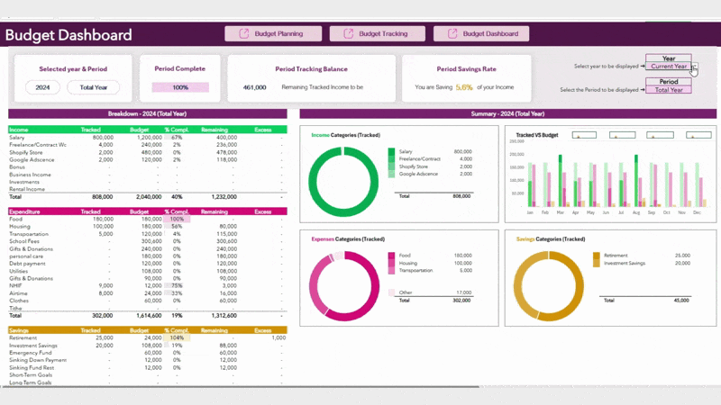
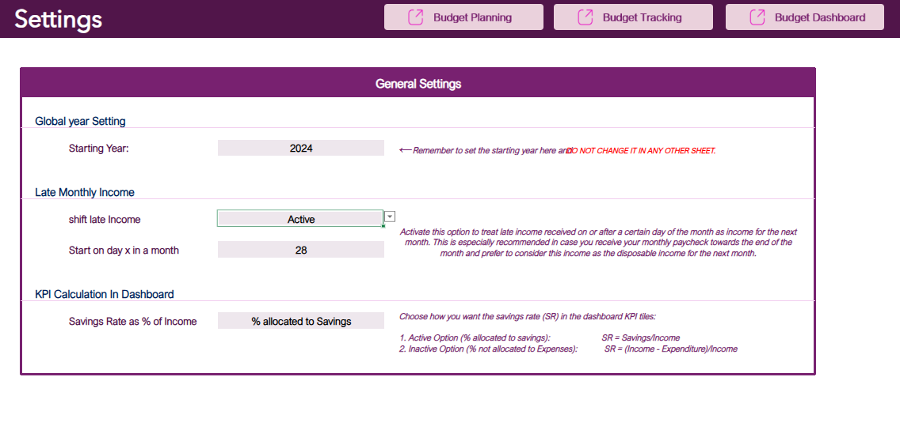
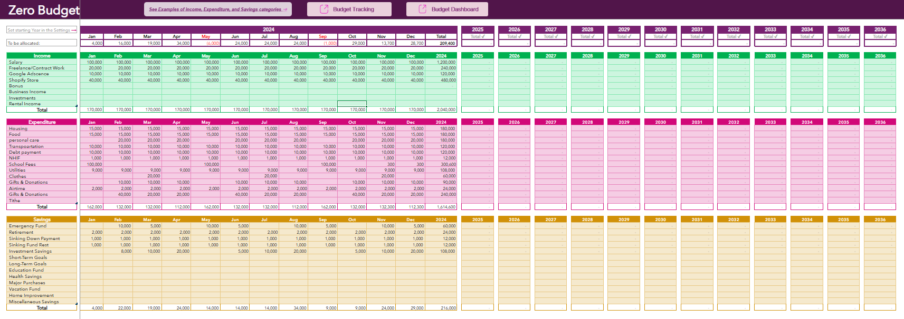
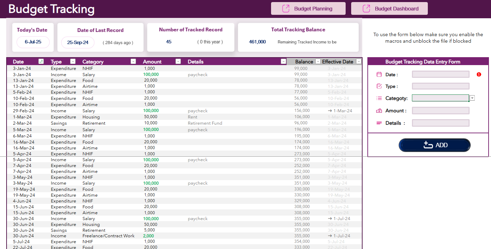
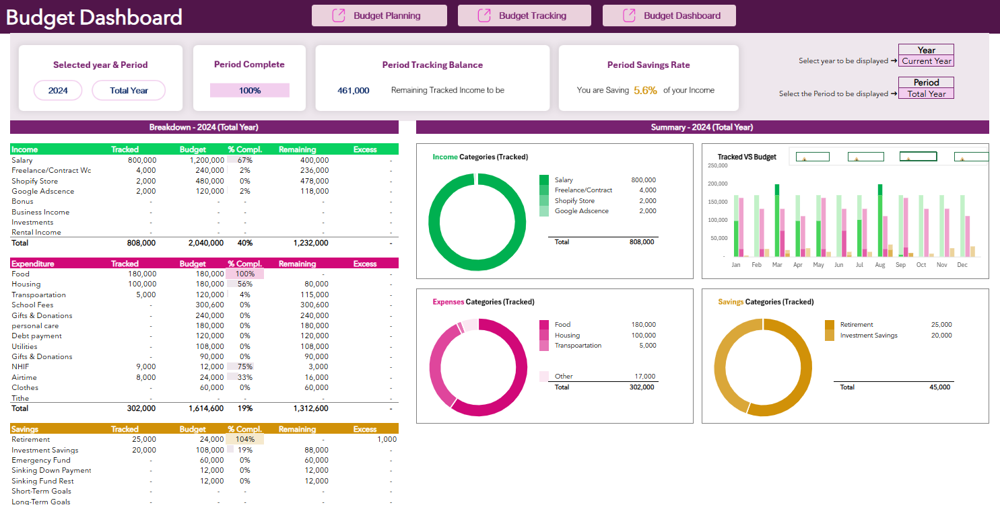
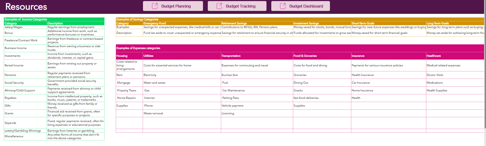
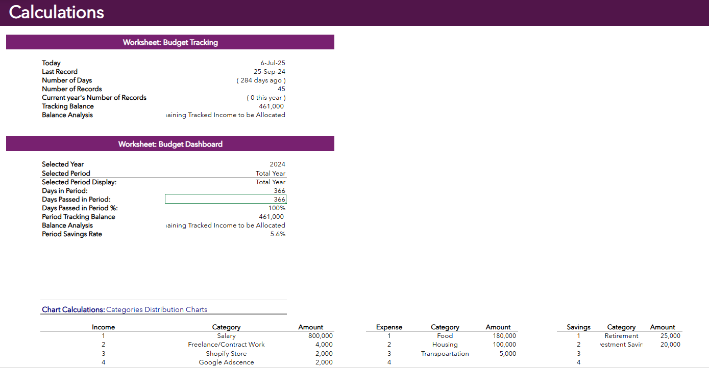

# Personal-Finance-Budgeting [Excel]

This is an advanced excel template for personal budgeting uses the zero budgeting criteria

_Created on: ‎Sunday, ‎7 ‎July ‎2024_

## Features

### 1. Settings Page

Here you can set

- the starting year,
- Activate / Deactivate whether to shift late income
- the date of the month you want to start shifting late income.
- the Savings Rate (SR) in the dashboard KPI tiles as either _Savings/Income_ (active option) or _(Income − Expenditure) / Income_ (inactive option).

### 2.Budget Planning

- In this sheet all the plans are listed in categories for income, expenses, savings.
- The categories are dynamic ca be added or removed and once added will reflect in all the other sheets Tracking, calculations & the Dashboard.
- Months for each year are grouped together and can be expanded and collapsed.
- The Years can be added as many as you want.

### 3.Budget Tracking

- This sheet is where all the income, expenses and savings are tracked.
- This means any transaction made is entered here.
- Macro Categories which are Income, Expenses and Savings are the first layer of categorization.
- The transactions are categorized by the corresponding category(selecting from dynamic dropdown in respect to macro category(type of transaction)) set in the Budget Planning sheet.
- Depending on the date of the month selected to shift the late income effective date is shown and if income is shifted an arrow is shown to indicate the shift.
- also after the amount is entered the balance is updated dynamically.

  **_Other features are_**

- date of the last transaction & how many days ago it was.
- Number of transaction records are also updated.
- Total tracking balance is also updated.
- A form that dynamically adds a new row of transactions instead of scrolling down just to add a new transaction.

### 4.Budget Dashboard

- This sheet is where all the KPI tiles are listed and the data is updated dynamically.
- You get to see all your financial data summary/Story in one place.
- Beautiful & functional UI with indicators

### 5.Resources

This sheet has resources on some of the most commonly used categories for income, expenses and savings.

### 6.Calculations

This is the heartbeat of this Budgeting template.
It contains all the calculations and formulas used in the whole template.
Therefore DO NOT EDIT THIS SHEET.

# How to use

**Note:** This Template uses the zero budgeting criteria where all income is allocated to either savings or expenses, hence the name.

- To use this template you start at the settings page. Here you can set the starting year, activate/deactivate whether to shift late income and the date of the month you want to start shifting late income.

- Once you have set the settings you can start adding your budget plans. Here you can add as many categories as you want. Refer to the Resources sheet for inspiration.

- Once you have added your budget plans you can start tracking your income, expenses and savings.

- To see your financial position you can go to the dashboard page. Here you can see all your financial data summary/Story in one place.
