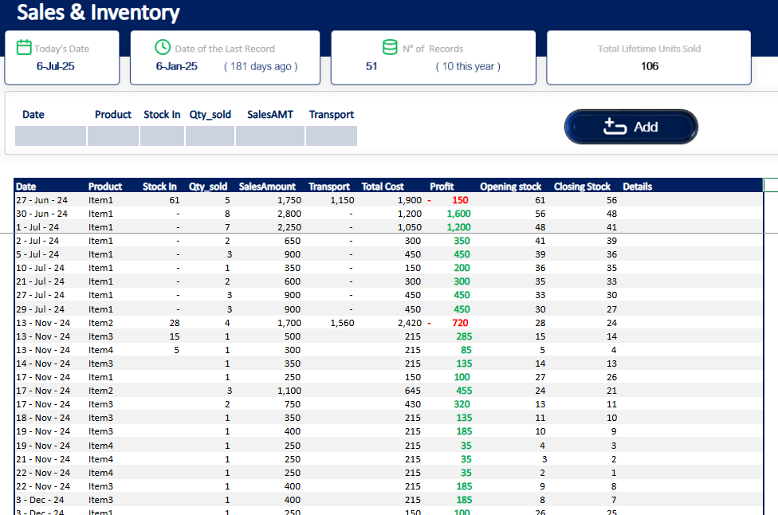
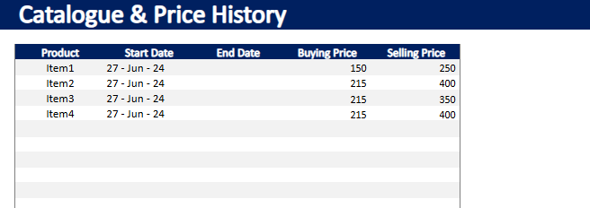

# Sales & Inventory Template - Excel

## How to use

- In the catalogue sheet, you can add products along with their buying and selling prices.
- You can set start and end dates for each product's price, allowing you to manage price changes over time.
- To update a product's price:

  - Enter the end date for the current price.
  - Copy the product entry in a new row, set the new price, and specify the new start date.
    _this will not affect past or future records in the sales and inventory sheet_
  - The new price period is automatically managed after inputting the end date.

- In the sales and inventory sheet, you can input your sales records where you can enter a new row at the last row of the table or just use the form to add a new row.
- Enter the following details for each transaction:
  - **Date of transaction**
  - **Product** (auto-populated dropdown from the catalogue sheet)
  - **Stock in** (if inventory is added on this date)
  - **Quantity sold**
  - **Price**
  - **Total amount**
- After entering the data, stock numbers and KPIs are automatically updated.

---

Finally you can get the overview & KPIs of your sales and inventory by clicking on the dashboard.
